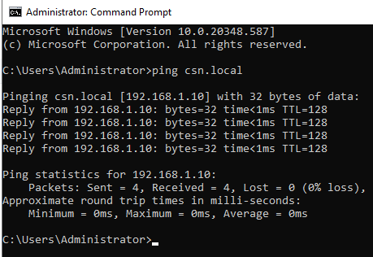
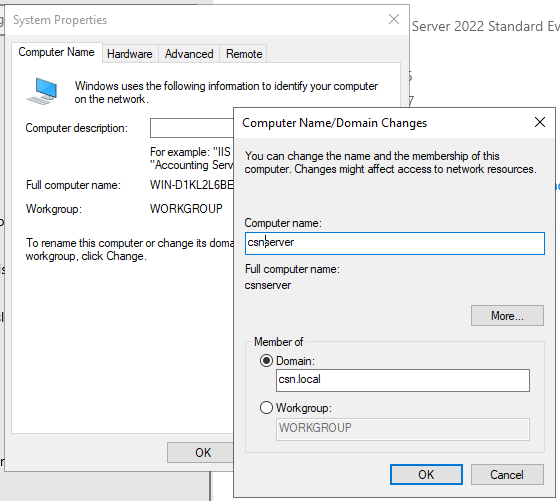
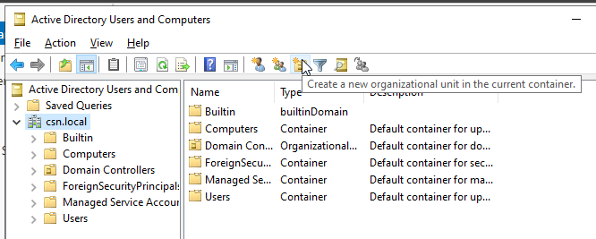
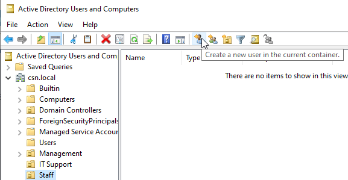
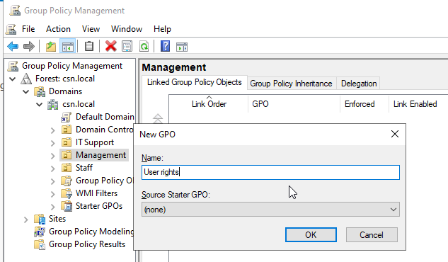
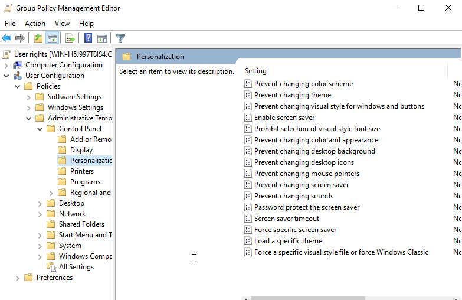

# Standard Operating Procedure (SOP) 

 

**Process Title:** Joining Parent Company CSN’s Active Directory Domain 

**Group Name:** Group 2 

**Created by:** Chigozirim Success Ibe, Niccolai Peralta, Sanjam Kaur 

**Date:** 3/31/2025 

 

--- 

 

## Purpose 

 

The purpose of this Standard Operating Procedure (SOP) is to provide a structured and repeatable method for integrating new users and departments into CSN Company’s Active Directory (AD) infrastructure. This sop ensures that all staff with administrative permissions follow a consistent approach when joining systems to the domain, creating organizational units, and applying group policies. by adhering to this sop, company can ensure operational consistency, reduce misconfiguration risks, and maintain compliance with security and usability standards.  

 

## 1. Introduction 

 

This document describes a thorough process for including three additional departments into the current Active Directory (AD) system of CSN Company. Aiming at improving organizational structure, enforcing security regulations, and simplifying user and system administration across the recently acquired divisions, the integration program seeks to standardize processes and enhance efficiency. 

 

Ten new users in all will be effectively connected to the domain of the company as part of this procedure. These user accounts will be developed and set according to CSN's usual onboarding processes, therefore guaranteeing consistency in user profile implementation, naming procedures, and access privileges. 

 

Three Organizational Units (OUs) will be established to assist departmental separation and assigned management; each will reflect a different department or functional group. This proper structure of resources and users will help to apply policies and enable focused management as well as better scalability for next organizational expansion. 

 

--- 

 

## 2. Objectives 

 

- Successfully join 10 users to the parent company’s AD through the Company’s standard procedures to ensure compatibility with the current policies set by the company. 

- Create 3 OUs (**Management, IT Support, and Staff**) based on role/function. 

- Apply appropriate GPOs for security, usability, and compliance. 

- Ensure replicability and documentation for future onboarding. 

 

--- 

 

## 3. Prerequisites 

 

Requirement           | Description                                     


Admin Access          | Domain Admin or Delegated Permissions           

Network Configuration | VPN/Direct Network Access to Domain Controller  

System Requirements   | Windows 10/11 Professional or Enterprise        

DNS Configuration     | Client must point to AD-integrated DNS          

Documentation         | List of users, roles, and software requirements 

 


 

## 4. Tools & Resources 

 

### Active Directory Users and Computers (ADUC) 

 

A Microsoft Management Console (MMC) snap-in, ADUC offers a graphical interface for Active Directory object administration. This tool will be used to: 

 

- Create and manage user accounts. 

- Design and arrange Organizational Units (OUs). 

- Delegate administrative rights. 

- Place users in appropriate OUs. 

 

### Group Policy Management Console (GPMC) 

 

GPMC is a centralized administrative tool for managing Group Policy in Windows Server environments. It allows for: 

 

- Creation and editing of GPOs 

- Linking GPOs to specific OUs 

- Applying security settings, usability improvements, and compliance controls 

- Testing and simulating GPO application using RSoP 

 

### Command Prompt / PowerShell 

 

These tools are essential for: 

 

- Joining computers to the domain 

- Creating users, groups, and OUs via scripts 

- Applying and troubleshooting GPOs 

- Performing network diagnostics and system automation 

 

### Event Viewer (for Troubleshooting) 

 

Event Viewer helps identify issues by monitoring logs related to: 

 

- Domain join attempts 

- User login success/failure 

- GPO processing errors 

- Network and DNS-related warnings 

 

--- 

 

## 5. Step-by-Step Instructions 

 

### Step 1: Verify Network & DNS Settings 

 

- Ensure the joining systems are on the same network or connected via VPN. 

- Set DNS to domain controller IP (e.g., 192.168.1.10). 
  


- Test with: `ping csn.local` 
  
 

### Step 2: Join Computer to Domain 

 

- Right-click **This PC > Properties > Change settings** 

- Under **Computer Name**, click **Change** 

- Select **Domain**, enter: `csn.local` 

- Provide domain admin credentials 

- Restart the computer when prompted 
  
   
 

 

### Step 3: Create Organizational Units (OUs) 

 

- Open **ADUC** 

- Navigate to `csn.local` domain 

- Right-click > New > Organizational Unit 

- Create: 

  - OU: Management 

  - OU: IT Support 

  - OU: Staff
  
 

### Step 4: Add Users to Domain and Assign to OUs 

 

- Inside each OU > Right-click > New > User   

- Enter details: 

  - First/Last Name 

  - Username (e.g., jdoe) 

  - Temporary password (set to change on next login) 

- Assign users: 

  - Management: 2 users 

  - IT Support: 3 users 

  - Staff: 5 users 

 

### Step 5: Create and Link Group Policies 

 

- Open **GPMC** 

- Right-click each OU > Create a GPO (e.g., GPO\_Management) 

- Edit each GPO to include: 

  - Password complexity 

  - Screen lock timeout 

  - User rights assignments 

  - Drive mappings/login scripts (optional)   

- Link each GPO to its respective OU 

- Run `gpupdate /force` on clients or wait for refresh 

 

### Step 6: Test User Logins 

 

- Log in using new accounts 

- Verify: 

  - GPOs are applied (desktop restrictions, mapped drives) 

  - Access to network resources is functional 

 

### Step 7: Document Configuration 

 

- Export user and OU details 

- Backup GPOs using PowerShell: 

   

```powershell 

Backup-GPO -Name "GPO_Management" -Path "C:\GPOBackups" 

``` 

 

--- 

 

## 6. Troubleshooting 

 

**Issue**            **Resolution**


Unable to join domain  - check if the client has appropriate DNS settings linking to the domain controller<br>- Verify no firewall is blocking required ports (e.g., 88, 389)

GPO not applying      - Use the commands `gpresult /h report.html` or run `gpresult to check GPO status /r`<br>- Verify the user or computer is in the correct Organizational Unit where GPO is applied             | 

Login issues          - Verify if the account is locked or blocked using Active Directory Users and Computers with your admin priviledges (ADUC)<br>- Reseting the password if forgotten is also a way to solve loggies issues.                                     | 

Replication issues    - Run `repadmin /showrepl` to get comprehensive replication partner information<br>- Use `repadmin /replsummary` to quickly review replication health<br>- Mst Importantly, Verify there isn't any DNS resolution issues between domain controllers (DCs) and SERVER | 

 

 

 

--- 

 

## 7. Conclusion / Purpose 

 

This SOP outlines the systematic approach to integrating a small team into the parent company’s Active Directory. With 10 users, 3 OUs, and relevant GPOs in place, this ensures scalability, security, and streamlined administrative control for CSN’s IT infrastructure. 

 

--- 

 

## 8. Visual Aids (Recommended) 

 

- Screenshot of the domain join window 

- Screenshot of ADUC with created OUs 

- GPO editor screenshot 

- `gpresult` output sample 

 

--- 

 

## 9. Appendix 

 

**Tools Used:** ADUC, GPMC, PowerShell, Event Viewer 

**Useful Commands:** 

 

**Command**

 

`whoami`  

`gpupdate /force`  

`net config workstation`  

`hostname`  

`net user <username>` 

`net group <groupname> /domain`

`gpresult /R`  

 


 

## 10. Accountability Matrix 

 

Task                               Responsible Team Member 


Drafting SOP                       | Chigozirim Success Ibe  

Technical Validation & Testing     | Niccolai Peralta         

Visual Aids & Documentation Backup | Sanjam Kaur              

Group Policy Configuration         | Niccolai Peralta         

Final Review and Submission        | All Members              

 


 

## 11. Approval Table 

 

Name                   | Role        | Date Approved 


Chigozirim Success Ibe | Team Member | 03/31/2025    

Niccolai Peralta       | Team Member | 03/31/2025    

Sanjam Kaur            | Team Member | 03/31/2025    

 


 

## 12. Reversion History 

 

Version | Date       | Author(s)                     | Description                       


1.0     | 03/29/2025 | Chigozirim Success Ibe        | Initial draft of SOP              

1.1     | 03/30/2025 | Niccolai Peralta, Sanjam Kaur | Technical edits and visual aids   

1.2     | 03/31/2025 | Group 2 (All Members)         | Final review and rubric alignment 

